<h1 align="center">
  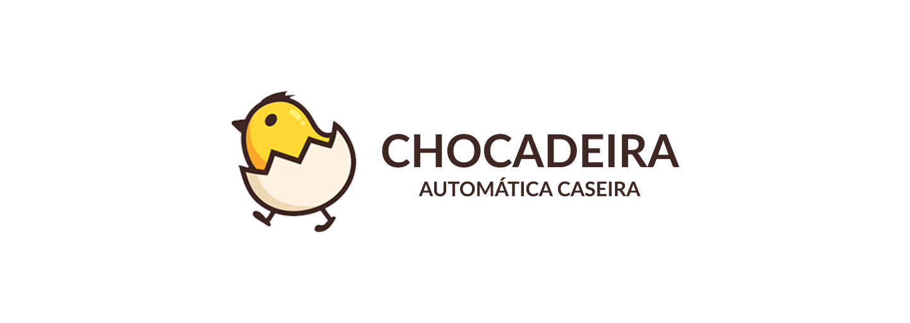
</h1>

Chocadeira automática de baixo custo utilizando Arduino

<a href="https://github.com/tilnoene/chocadeira/blob/main/README-en.md">README in English</a>

  
  
  

<ul>
  <li><a href="#-sobre-o-projeto">💬 Sobre o projeto</a></li>
  <ul>
    <li><a href="#-tecnologias">🛠 Tecnologias</a></li>
    <li><a href="#-materiais">🧰 Materiais</a></li>
    <li><a href="#%EF%B8%8F-esquemático">✍️ Esquemático</a></li>
  </ul>
  
  <li><a href="#%EF%B8%8F-processo">🛠️ Processo</a></li>
  <ul>
    <li><a href="#-construção">🔨 Construção</a></li>
    <li><a href="#%EF%B8%8F-como-executar">⚙️ Como executar</a></li>
    <li><a href="#-como-utilizar">❓ Como utilizar</a></li>
  </ul>

  <li><a href="#%EF%B8%8F-resultados">✔️ Resultados</a></li>
  <ul>
    <li><a href="#%EF%B8%8F-vídeo">▶️ Vídeo</a></li>
    <li><a href="#-fotos">📷 Fotos</a></li>
    <li><a href="#-custo-total">💲 Custo total</a></li>
  </ul>

  <li><a href="#-conclusões">🔮 Conclusões</a></li>
  <ul>
    <li><a href="#%EF%B8%8F-temperatura-e-umidade-ideais">🌡️ Temperatura e umidade ideais</a></li>
    <li><a href="#-lâmpada-ou-resistência">💡 Lâmpada ou resistência</a></li>
    <li><a href="#-isopor-ou-madeira">📦 Isopor ou madeira</a></li>
    <li><a href="#-consumo-de-energia">⚡ Consumo de energia</a></li>
  </ul>
  <li><a href="#-autor">🌌 Sobre o autor</a>
</ul>

---

<h2>💬 Sobre o projeto</h2>

Este projeto foi criado para meu tio, um produtor rural, visando atingir um preço acessível em relação às chocadeiras comerciais.

A mantenabilidade é outro fator importante a ser considerado. Caso algum componente apresente problemas, é possível substituir adquirindo outro pela internet tendo um conhecimento mínimo sobre o projeto.

Por se tratar de um protótipo, é possível incrementá-lo de acordo com seu conhecimento técnico e condição financeira, para isso basta adquirir os componentes necessários e alterar o código ao invés de adquirir uma chocadeira nova.

A primeira versão foi utilizando lâmpadas LED, e hoje estamos utilizando resistência.

<h3>🛠 Tecnologias</h3>

O projeto foi desenvolvido na linguagem C++ utilizando a IDE do Arduino.

As bibliotecas utilizadas estão na pasta <a href="https://github.com/tilnoene/chocadeira/tree/main/libraries" target="_blank">libraries</a>.

<h3>🧰 Materiais</h3>

- Microcontrolador Arduino (foi utilizado um Arduino Nano)
- DHT11 ou DHT22 - Sensor de umidade e temperatura
- Módulo Relé
- Fonte 9V 1A Bivolt (ou fonte 12V)
- Lâmpada LED ou Resistência
- Fan ou Cooler de computador (mini ventilador)
- Plug de tomada macho
- Isopor ou caixa de madeira
- Fios elétricos
- Jumpers macho/macho

<h3>Opcionais</h3>

- Protoboard (_evitar solda nos componentes_)
- Display LCD 16x2 + Adaptador LCD I2C (_exibir as informações em tempo real_)
- RTC DS3231 (_relógio_)
- Ponte H modelo L293D ou L298N (_permite trabalhar com motores_)
- Motor comum, motor de passo ou servomotor (_rolagem automática dos ovos; requer módulo de relógio e ponte H_)

Conforme listado, alguns itens são opcionais e vão de acordo com sua necessidade e disponibilidade. O projeto foi feito visando diminuir o custo, então não utilizamos motores para rolagem automática dos ovos e relógio nessa versão.

Vale ressaltar que alguns materiais podem ser reciclados. Os fios, o ventilador e o plug de tomada que utilizamos foram de equipamentos velhos e a fonte foi adaptada.

<h3>✍️ Esquemático</h3>

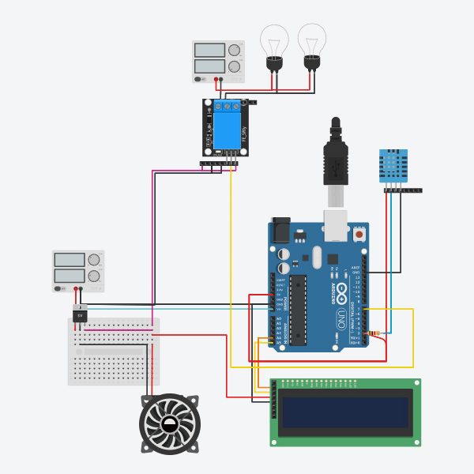

As conexões podem variar de acordo com o módulo utilizado.

O circuito foi criado utilizando o <a href="https://www.tinkercad.com/things/7F9rN1k2kGU-chocadeira-com-arduino-versao-simplificada">Tinkercad</a> e um editor de imagem (para os módulos que não estão presentes nessa plataforma).

---

<h2>🛠️ Processo</h2>

Aqui descrevemos parte do processo de contrução, execução e utilização do projeto. Mesmo que não utilize o microcontrolador Arduino ou os mesmos módulos, as ideias e experiências aqui presentes podem ser úteis e por isso decidi compartilhar nossa experiência.

<h3>🔨 Construção</h3>

Utilizamos um isopor de 60L, que tem capacidade em torno de 40 ovos de galinha.

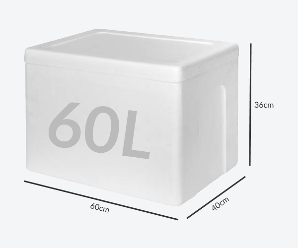

Fizemos um furo na frente para colocarmos uma vasilha com água, conforme a imagem abaixo.

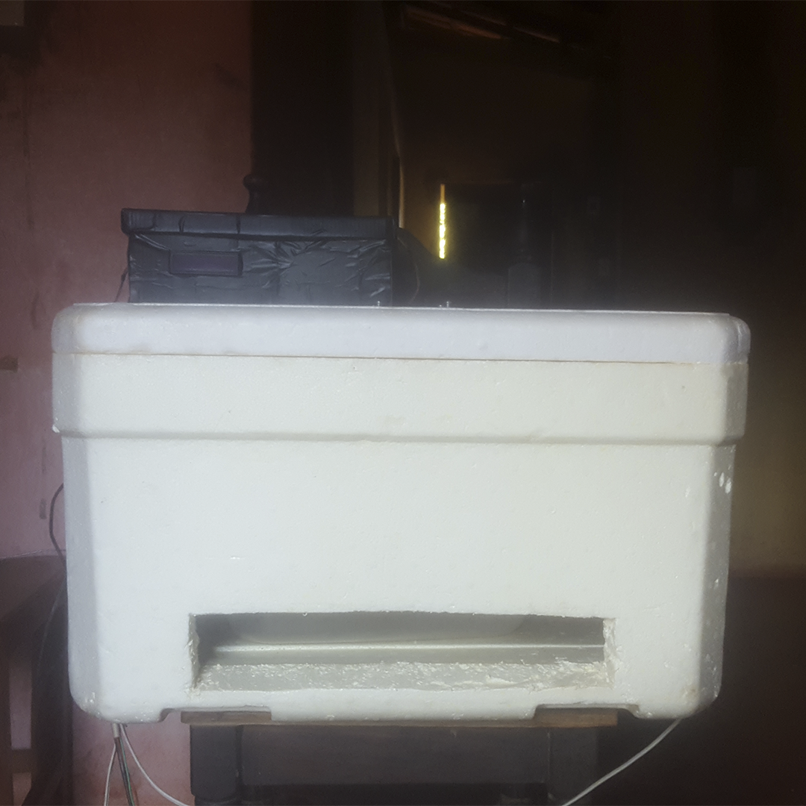

Uma grade foi feita de madeira para rolagem dos ovos, utilizando uma rede para prender os ovos e um arame que se extende até a parte exterior por um furo para movimentar a grade para frente e para trás, consequentemente girando os ovos.

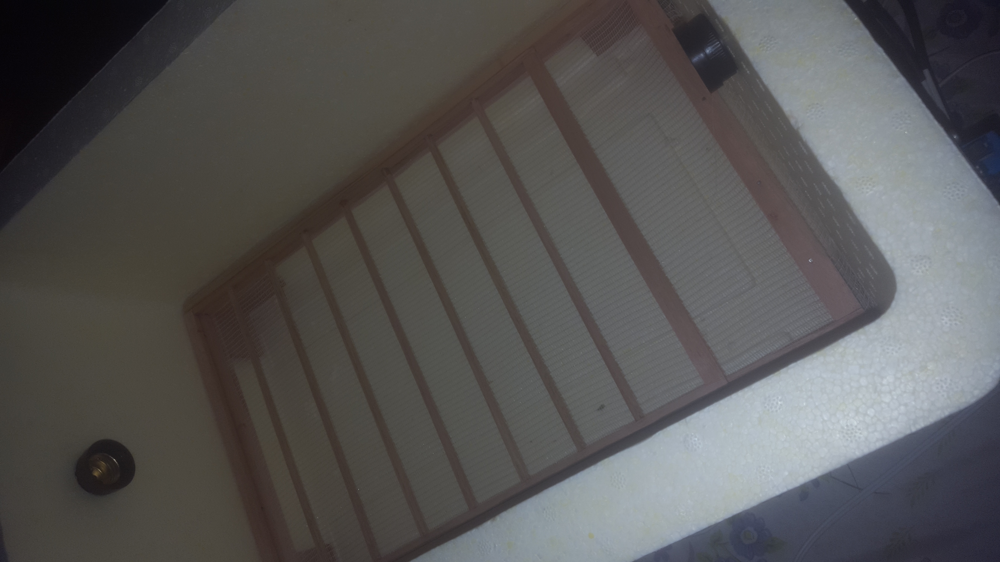

A montagem do circuito segue o [esquemático](#-esquemático) e foi feita em uma protoboard para evitar solda. O circuito principal fica dentro de uma caixa de sapato e o relé fica na lateral da caixa com um suporte de madeira.

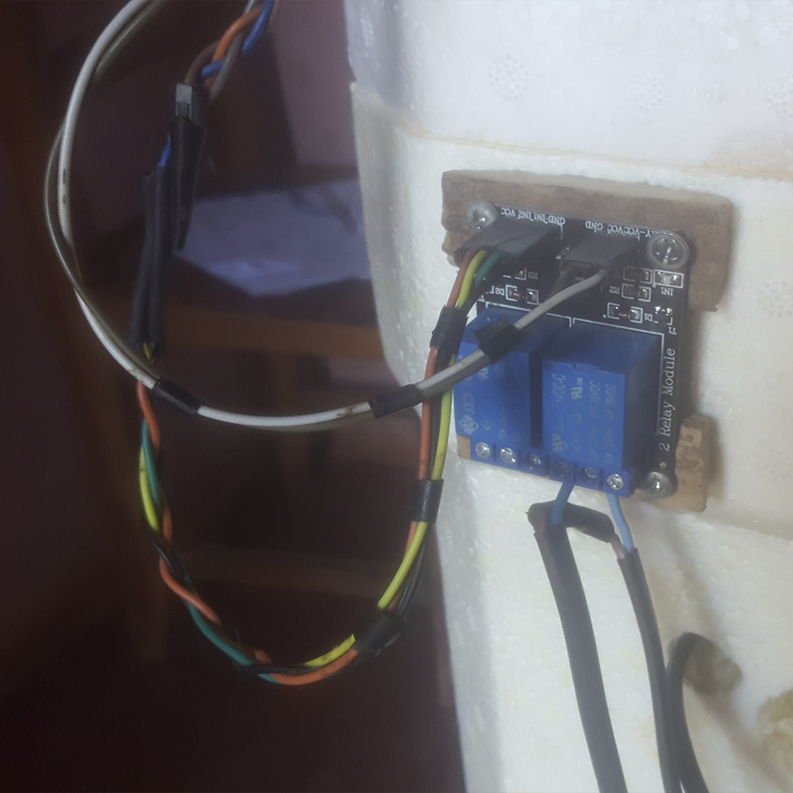

Na tampa, colocamos o ventilador e a resistência da seguinte forma:

Por esse mesmo furo na tampa que passa o fio do ventilador também passa o sensor de temperatura e umidade, que fica um pouco acima dos ovos.

<h3>⚙️ Como executar</h3>

Para carregar as bibliotecas vá em Sketch → Incluir Biblioteca → Adicionar biblioteca .ZIP → selecione o arquivo da biblioteca e repita o processo para as três.

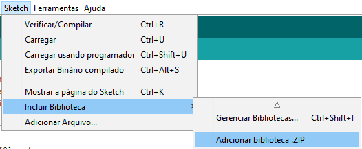

Para configurar a placa no Arduino IDE, escolha as opções no menu Ferramentas de acordo com seu modelo. No nosso caso utilizamos a seguinte configuração.

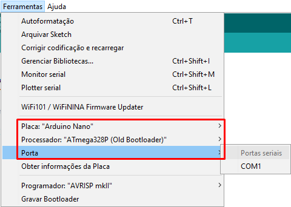

Para carregar o programa para a placa arduino, abra o arquivo <a href="https://github.com/tilnoene/chocadeira/brooder/brooder.ino" target="_blank">brooder.ino</a> na Arduino IDE. Conecte o arduino ao computador, escolha a porta serial no menu Ferramentas e clique no botão de seta para carregar.

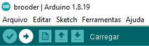

Durante o processo irá piscar uma luz verde na placa. Caso dê tudo certo, irá aparecer uma mensagem no console inferior afirmando que foi carregado.

A versão da Arudino IDE utilizada foi a 1.8.19.

<h3>❓ Como utilizar</h3>

Para utilizar basta conectar o circuito e as lâmpadas/resistência que estão intermediadas pelo módulo relé em uma tomada 220V e irá começar a funcionar.

O código funciona da seguinte forma: se a temperatura é menor ou igual 36ºC, a resistência é ligada durante 15s e desligada durante 3s. Esses tempos foram arbitrariados no código de acordo com os testes que realizamos e podem ser alterados manualmente.

Deixe algumas pequenas passagens de ar na caixa para haver troca de oxigênio dentro da chocadeira.

Também é necessário manter o recipiente inferior sempre com água. Ele aumenta a umidade dentro da caixa.

É necessário girar os ovos 180º duas vezes por dia todos os dias.

Mantenha a caixa sempre higienizada, retirando os ovos podres com o passar do tempo.

O tempo para incubação é de aproximadamente 21 dias. Alguns nascem dias antes e outros dias depois.

---

<h2>✔️ Resultados</h2>

<h3>▶️ Vídeo</h3>

🚧 Em construção 🚧

<h3>📷 Fotos</h3>

Todas as fotos disponíveis estão na pasta <a href="https://github.com/tilnoene/chocadeira/tree/main/assets/pictures" target="_blank">assets/pictures</a>.

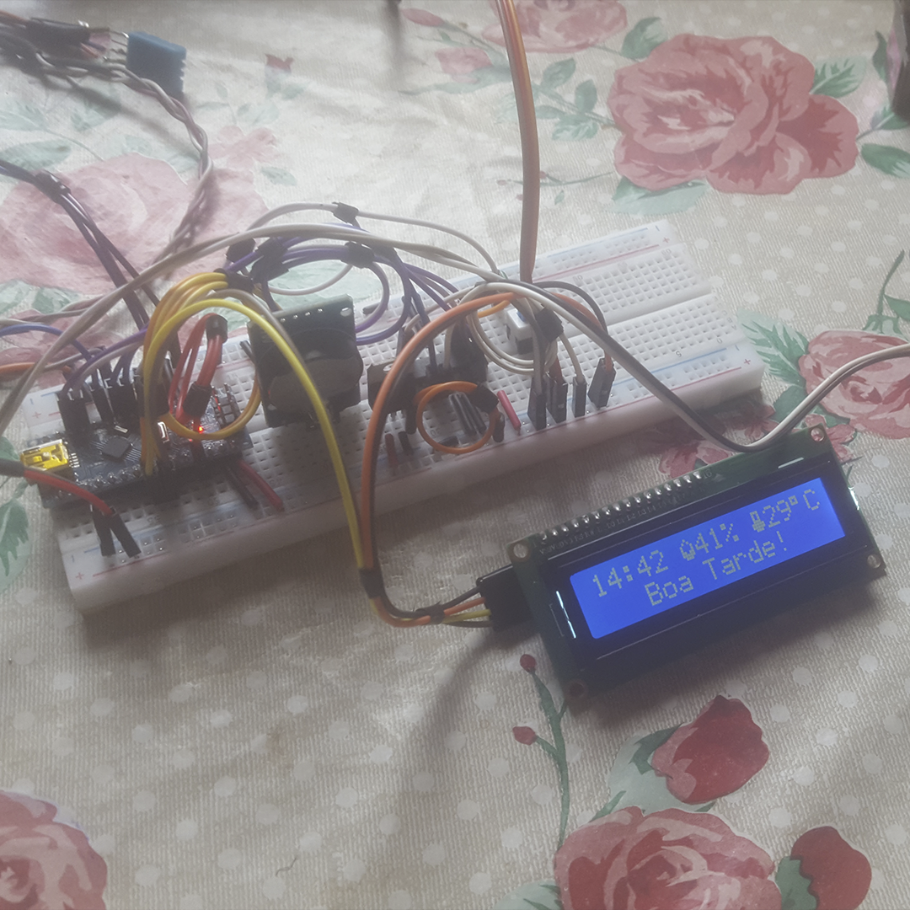

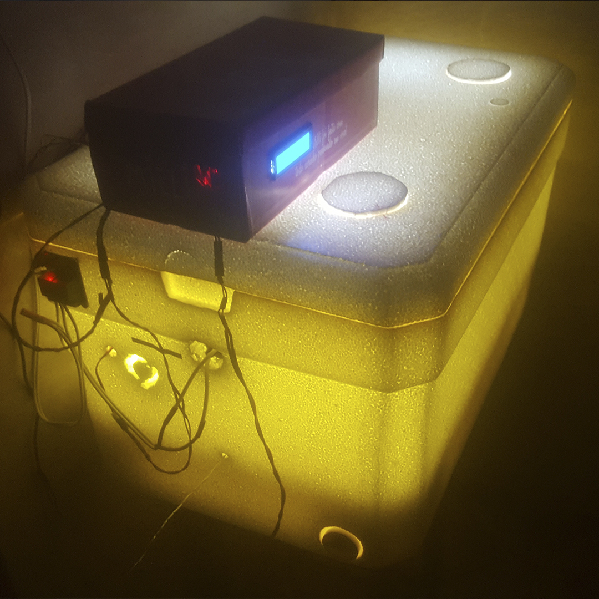

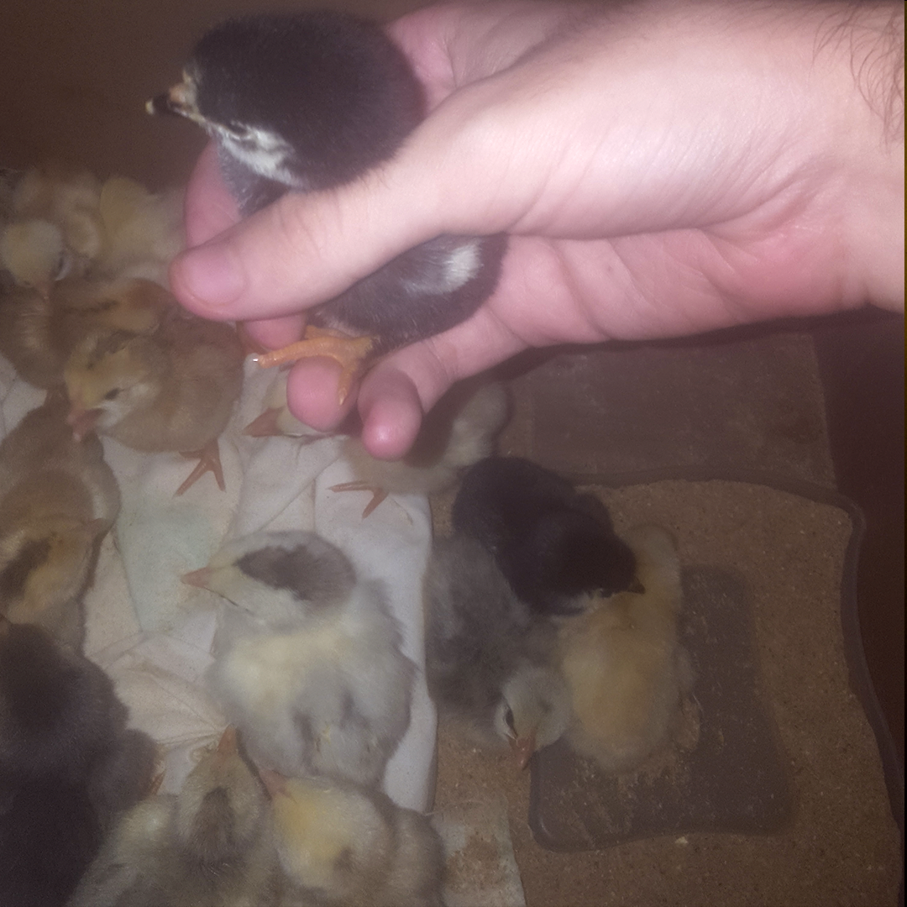

<h3>💲 Custo total</h3>

Caso compre os módulos na China, o preço tende a reduzir consideravelmente.

Preços em lojas brasileiras no dia 20/05/2022.

Produto | Preço
------- | -----
Módulo Relé 5V | R$7,00
DHT11 | R$20,00
Fonte 9V 1A | R$15,00
Plug de tomada macho | R$2,50
Arduino Nano | R$48,00
Kit Jumpers macho/macho | R$5,00
Isopor 60L | R$75,00
Kit resistência | R$35,00
**Total** | R$207,50

Não estamos considerando com os fios e o ventilador (podem ser reciclados/adquiridos em lojas de manutenção como sucata), nem o display LCD que é opcional.

---

<h2>🔮 Conclusões</h2>

Conclusões sobre o projeto, com análise sobre alguns dos problemas enfrentados.

<h3>🌡️ Temperatura e umidade ideais</h3>

<b>Temperatura ideal: 37.8Cº.</b> Como a precisão do nosso sensor era baixa por ser um modelo simples, a temperatura sempre varia entre 36Cº e 38Cº, como explicado na seção <a href="#-como-utilizar">Como utilizar</a>.

<b>Umidade ideal: 55% à 65%.</b> Não estamos controlando automaticamente a umidade, mas sempre mantendo o recipiente inferior com água, o fan (ventilador) superior sempre ligado e alguns furos na tampa abertos durante alguns dias.

<h3>💡 Lâmpada ou resistência</h3>

Utilizamos 2 lâmpadas na versão inicial do projeto, depois testamos resistência e estamos preferindo ela.

Vantagens da resistência:
- Distribui o calor de forma uniforme.  A lâmpada esquentava muito nos ovos das extrmidades e menos no centro, percebemos que isso acabava diminuindo a taxa de eclosão.
- Não emite luz. Além de poder incomodar à noite, estava atraindo mosquitos, por estar numa área rural, onde alguns conseguiam entrar dentro da caixa de isopor, prejudicando a higienização.

Desvantagens da resistência:
- Mais difícil de econtrar para reposição em lojas físicas. Compramos um kit pela internet.

<h3>📦 Isopor ou madeira</h3>

Optamos por utilizar uma caixa isopor pelo preço e por ser mais simples de conseguir.

Vantagens da caixa de isopor:
- Preço.
- Fácil de encontrar para comprar quando comparado a caixa de madeira.
- Mantém e distribui melhor o calor.
- É mais fácil realizar cortes na caixa, como para retirada da caixa com água, circulação de ar ou para passagem de fios.

Desvantagens da caixa de isopor:
- É mais frágil. A parte interior da tampa, por estar perto da resistência por muito tempo, começou a derreter.
- Transparece grande parte da luz, caso utiliza lâmpadas ao invés de resistência.

<h3>⚡ Consumo de energia</h3>

O consumo não foi algo que impactou, ao contrário do que imaginávamos, mesmo com as lâmpadas LED. Não foi possível medir exatamente o consumo, mas houve um aumento de aproximadamente R$2 na conta de luz.

---

<h2>🌌 Sobre o autor</h2>

<table>
  <tr>
    <td align="center">
      <a href="https://github.com/tilnoene" target="_blank">
        
         
        
          <b>Victor Manuel</b>
        
      </a>
       
    </td>
</table>

Estudante de graduação em ciência da computação na Universidade de Brasília. Entusiasta de tecnologia e praticante de programação competitiva no tempo livre.

  

  

  

